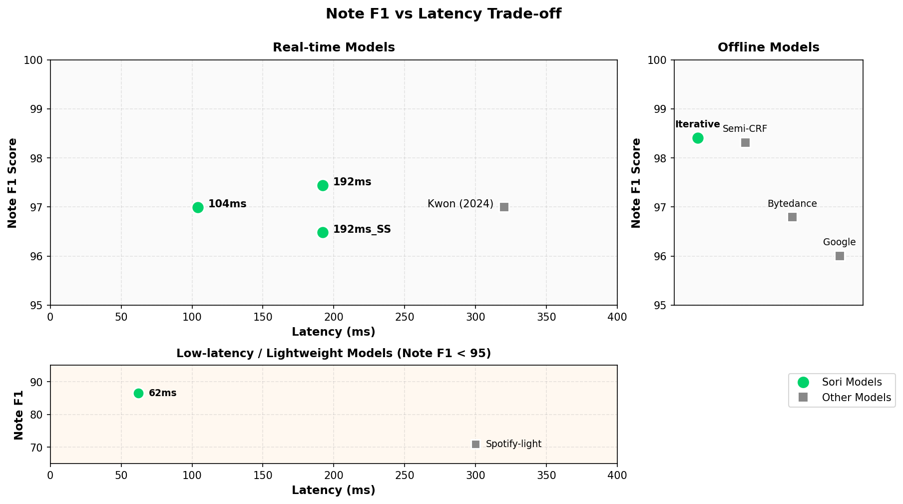

  

<h1 align="center">Sori Audio-to-MIDI Leaderboard</h1>

  <strong>Real-time Piano Transcription AI</strong> 
  State-of-the-art Audio-to-MIDI technology with ultra-low latency

  <a href="#benchmark-results">Benchmarks</a> •
  <a href="#technical-details">Technical Details</a> •
  <a href="#contact">Contact</a>

---

## Benchmark Results

Quantitative evaluation results on standard datasets.

### Note F1 vs Latency Trade-off

  

<!-- BENCHMARK_TABLE_START -->
### MAESTRO v3 Test Set (177 tracks)

| Model | Note F1 | Note+Vel F1 | Note+Off F1 | Note+Off+Vel F1 | Params | Delay |
|:------|:-------:|:-----------:|:-----------:|:---------------:|:------:|:-----:|
| **Sori-Offline_Iterative** | 98.41 | 80.16 | 80.67 | N/A | N/A | Offline |
| Semi-CRF | 98.32 | 92.94 | 93.48 | N/A | N/A | Offline |
| **Sori-Realtime4.8M_192ms** | 97.44 | 95.08 | 72.91 | 71.44 | 4.8M | 192ms |
| Taegyun Kwon (2024) | 97.00 | N/A | 87.90 | 86.80 | 19.7M | 320ms |
| **Sori-Realtime4.8M_104ms** | 96.99 | 92.72 | 86.17 | 82.58 | 4.8M | 104ms |
| Bytedance | 96.80 | N/A | 84.70 | 83.30 | 20.2M | Offline |
| **Sori-Realtime4.8M_192ms_SS** | 96.49 | 90.66 | 70.42 | 66.61 | 4.8M | 192ms |
| Yamaha Mobile-AMT | 96.30 | N/A | 76.80 | 75.53 | 5.9M | 10s |
| Google | 96.01 | N/A | 83.94 | 82.75 | 54M | Offline |
| **Sori-Realtime4.8M_62ms** | 86.49 | 80.09 | 45.71 | 43.15 | 4.8M | 62ms |
| Spotify-light | 70.90 | N/A | 10.50 | N/A | 16K | 300ms |

View Detailed Metrics

#### Sori-Offline_Iterative

| Metric | F1 | Precision | Recall |
|:-------|:--:|:---------:|:------:|
| Note (onset only) | 98.41 | 99.47 | 97.40 |
| Note + Velocity | 80.16 | N/A | N/A |
| Note + Offsets | 80.67 | 81.51 | 79.86 |
| Note + Offsets + Velocity | N/A | N/A | N/A |

#### Sori-Realtime4.8M_192ms

| Metric | F1 | Precision | Recall |
|:-------|:--:|:---------:|:------:|
| Note (onset only) | 97.44 | 99.36 | 95.66 |
| Note + Velocity | 95.08 | 96.94 | 93.36 |
| Note + Offsets | 72.91 | 74.18 | 71.72 |
| Note + Offsets + Velocity | 71.44 | 72.67 | 70.28 |

#### Sori-Realtime4.8M_104ms

| Metric | F1 | Precision | Recall |
|:-------|:--:|:---------:|:------:|
| Note (onset only) | 96.99 | 98.81 | 95.28 |
| Note + Velocity | 92.72 | 94.46 | 91.10 |
| Note + Offsets | 86.17 | 87.77 | 84.68 |
| Note + Offsets + Velocity | 82.58 | 84.10 | 81.15 |

#### Sori-Realtime4.8M_192ms_SS

| Metric | F1 | Precision | Recall |
|:-------|:--:|:---------:|:------:|
| Note (onset only) | 96.49 | 99.11 | 94.09 |
| Note + Velocity | 90.66 | 93.08 | 88.43 |
| Note + Offsets | 70.42 | 72.17 | 68.81 |
| Note + Offsets + Velocity | 66.61 | 68.25 | 65.11 |

#### Sori-Realtime4.8M_62ms

| Metric | F1 | Precision | Recall |
|:-------|:--:|:---------:|:------:|
| Note (onset only) | 86.49 | 97.77 | 78.47 |
| Note + Velocity | 80.09 | 90.37 | 72.76 |
| Note + Offsets | 45.71 | 50.97 | 41.87 |
| Note + Offsets + Velocity | 43.15 | 48.05 | 39.57 |

<!-- BENCHMARK_TABLE_END -->

### Metric Definitions

| Metric | Description |
|--------|-------------|
| **Note F1** | Onset-only evaluation (±50ms tolerance) |
| **Note+Vel F1** | Onset + Velocity accuracy |
| **Note+Off F1** | Onset + Offset accuracy |
| **Note+Off+Vel F1** | Onset + Offset + Velocity combined |

---

## Technical Details

### Model Lineup

| Model | Parameters | Delay | Features |
|:------|:----------:|:-----:|:---------|
| **Sori-Offline_Iterative** | N/A | Offline | Highest accuracy with iterative refinement |
| **Sori-Realtime4.8M_192ms** | 4.8M | 192ms | Best real-time performance |
| **Sori-Realtime4.8M_192ms_SS** | 4.8M | 192ms | Source separation for noisy environments |
| **Sori-Realtime4.8M_104ms** | 4.8M | 104ms | Low latency with improved offset accuracy |
| **Sori-Realtime4.8M_62ms** | 4.8M | 62ms | Ultra-low latency for live performance |

### Evaluation Methodology

- **Dataset**: MAESTRO v3 Test Set (177 tracks)
- **Metrics**: [mir_eval](https://craffel.github.io/mir_eval/) library
- **Framework**: PyTorch 2.0

---

## Contact

For inquiries, please contact:

  <a href="mailto:taegyun.kwon@sori-ai.com"><strong>taegyun.kwon@sori-ai.com</strong></a>

---

<!-- LAST_UPDATED_START -->
*Last updated: 2026-01-20 | Data version: v2.9.0*
<!-- LAST_UPDATED_END -->

  Made with 🎵 by Team Sori

